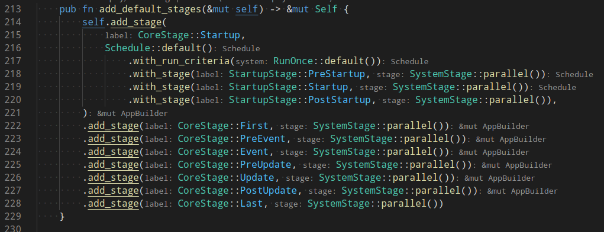

# bevy笔记

    bevy 中的 ECS 范式:
        E -> Entity, 实体, 比如速度, 颜色, 光的强度
        C -> Component, 组件, 一个明确的物体, 比如精灵, 太阳, 移动的物体
        S -> System, 系统, 它构成了 app 的整个运行过程,
            它可以是 app 启动时的 配置操作, 可以是 周期性地检查事件工作, 可以是 app 结束时 的清除资源操作.

    app 运行的整个周期 就是: 开始运行 -> update -> 结束运行, bevy 把这个过程用 Stage 来管理.

    StageLabel 在bevy中表示 app运行的不同阶段:

    下面是 bevy 定义的默认 StageLabel:

        CoreStage (StageLabel):
            Startup         在 app 启动的开始 运行一次
            First           在 其它的 app stages 之前 运行
            PreEvent        在 EVENT 之前 运行
            Event           在 UPDATE 之前 运行
            PreUpdate       在 UPDATE 之前 运行, 负责执行 setup
            Update          负责做大多数 app 逻辑, Systems 应该被注册在这里
            PostUpdate      在 UPDATE 之后 运行, 负责处理 UPDATE 的结果
            Last            在其它所有的 app stages 之后 运行

    Stage 便是 告诉 bevy 在 特定的 StageLabel 下, 应该做什么事情.

    app 对象 有3个属性:
        world
        runner
        schedule

    App::build() 就是 为了 构建 app, 并做 app 的初始化:

        App::default()

        add_default_stages()
        
        app_builder.add_default_stages(), 添加默认的策略
        即:
            

        SystemStage::parallel() 这创建一个 SystemStage, 它包含有 executor
